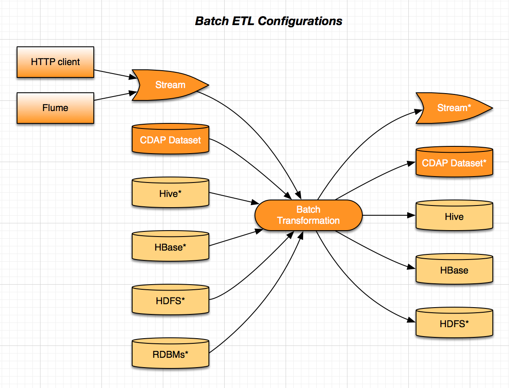
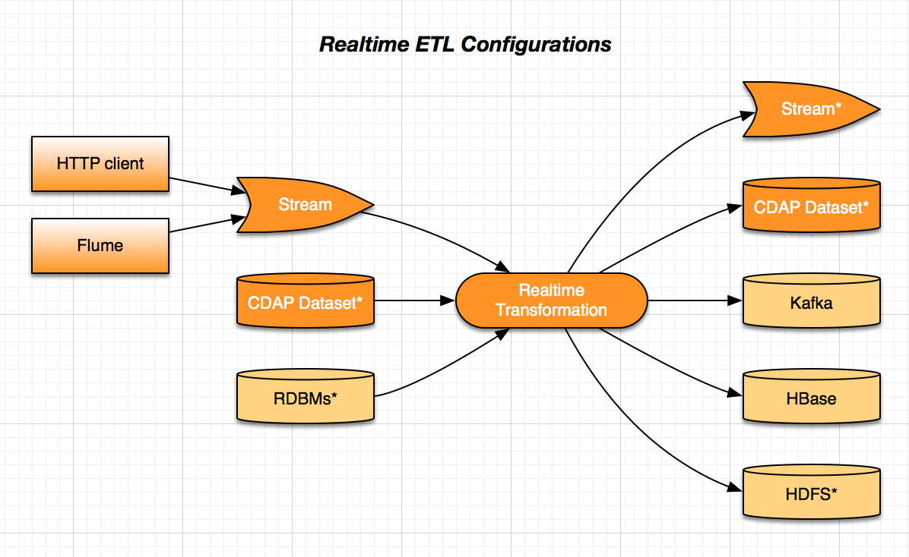

ETL pack Library
=======

The *ETL-pack* library is designed to ease the development of common ETL (extract, transform, and load) solutions and provides 
powerful extension capabilities. Developers can use it as-is without any coding required to perform standard tasks such as
incremental moving of data between Hive tables with applied transformation using input/ouput schema mapping and more.

At the same time, developers can implement their own source and sink types as well as
custom transformation logic. The *ETL-pack* provides the necessary abstractions and base
building-blocks so that developers can focus on business logic instead of infrastructure and
operation boilerplate. Developed components are both transferrable and re-usable in many
different environments with CDAP.

Batch and Realtime ETL
----------------------

Currently, the *ETL-pack* supports two types of ETL pipelines: batch and real-time. Batch processing happens with help of 
MapReduce jobs. Real-time processing utilizes a Flow. There are a number of configuration options 
for an ETL pipeline as displayed below.

|(Batch)|

|(Realtime)|

The base class for batch ETL is ``BatchETL``. The code below shows an example application developed using BatchETL with a 
pre-defined configuration:

.. code:: java

  public class StreamToHBaseETL extends BatchETL {
    @Override
    protected void configure(BatchETL.Configurer configurer) {
      configurer.addStream(new Stream("userDetails"));
      configurer.setSource(new StreamSource(getInSchema(), "userDetails"));
      configurer.setTransformation(
                 new DefaultSchemaMapping(getInSchema(), getOutSchema(), getMapping()));
      configurer.setSink(new HBaseSink("my.zk.quorum.host.net", "2181", "/hbase",
                                       "users-table", "colfam", "user_id"));
    }
 
    private Schema getInSchema() {
      return new Schema(ImmutableList.of(new Field("userId", FieldType.STRING),
                                         new Field("firstName", FieldType.STRING),
                                         new Field("lastName", FieldType.STRING)));
    }
  
    private Schema getOutSchema() {
      return new Schema(ImmutableList.of(new Field("user_id", FieldType.INT),
                                         new Field("name", FieldType.STRING)));
    }
  
    private ImmutableMap<String, String> getMapping() {
      return ImmutableMap.of("user_id", "userId",
                             "name", "first_name + ' ' + last_name");
    }
  }

Note that the Batch ETL application can be used as-is by providing the configuration (e.g., the one hard-coded in the
code sample above) with runtime arguments in JSON format. The latter method is used by the Subscription Management 
web app to avoid rebuilding application jars for different subscription configurations.

The base class for real-time ETL is ``RealtimeETL``. The following code shows an example application developed using 
``BatchETL`` with a pre-defined configuration:

.. code:: java

  public class StreamToKafkaETL extends RealtimeETL {
    @Override
    protected void configure(RealtimeETL.Configurer configurer) {
      configurer.addStream(new Stream("userDetails"));
      configurer.setSource(new SchemaSource(getInSchema(), "userDetails"));
      configurer.setTransformation(
        new DefaultSchemaMapping(getInSchema(), getOutSchema(), getMapping()));
      configurer.setSink(new KafkaSink("my.zk.quorum.host.net:2181", "my-kafka-topic"));
    }
  
    private Schema getInSchema() {...}
  
    private Schema getOutSchema() {...}
  
    private ImmutableMap<String, String> getMapping() {...}
  }
  
Note that similarly to the Batch ETL application, the Realtime ETL application can be used
as-is by providing the configuration with runtime arguments in JSON format.

Source
------

*ETL-pack* comes with a number of sources available out-of-the-box, such as
``TableSource``, ``StreamSource``, and ``MetadataSource`` which can be used in real-time
and batch ETL. It comes with higher-level abstractions and base classes to ease the
implementing of custom sources. This example shows the interfaces for implementing
real-time and batch cases:

.. code:: java

  public interface RealtimeSource extends ConfigurableProgram<FlowletContext> {
    Record read(StreamEvent streamEvent) throws Exception;
  }

.. code:: java

  public interface MapReduceSource<KEY_TYPE, VALUE_TYPE> extends ConfigurableProgram<MapReduceContext> {
    void prepareJob(MapReduceContext context);
    void onFinish(boolean succeeded, MapReduceContext context) throws Exception;
    Iterator<Record> read(KEY_TYPE key, VALUE_TYPE value);
  }

The example below is the implementation of a ``MetadataSource``, showing how easy it is 
to implement a custom source:

.. code:: java

  public class MetadataSource extends AbstractConfigurableProgram<FlowletContext> implements RealtimeSource {  
    @Override
    public Record read(StreamEvent streamEvent) throws Exception {
      Record.Builder builder = new Record.Builder();
      for (Map.Entry<String, String> header : streamEvent.getHeaders().entrySet()) {
        builder.add(header.getKey(), header.getValue().getBytes(Charsets.UTF_8));
      }
      return builder.build();
    }
  }

Available source types are Stream and Stream Metadata. The latter allows you to work with Stream events metadata.

Stream Source
~~~~~~~~~~~~~

The Stream Source uses the body of the stream event sent by the CDAP Router. Its sole configuration parameter 
is the name of the source stream::

  {
    "etl.source.mr.stream.id": "someStream"
  }

Similarly, for a real-time stream source::

  {
    "etl.source.realtime.stream.id": "someStream"
  }

In addition to this stream source, it uses an input schema. The schema is a list of fields defined by name and type::

  [
    {
      "name": "userId",
      "type": "INT"
    },
    {
      "name": "lastName",
      "type": "STRING"
    },
    {
      "name": "firstName",
      "type": "LONG"
    }
  ]

Available field types are STRING, INT, LONG, FLOAT, and DOUBLE.

Stream Metadata
~~~~~~~~~~~~~~~

The Stream Metadata source uses Stream event headers and Stream event metadata such as the size of the event’s body. 
Configuration of the Stream Metadata source is the same as the Stream source. The difference is that it 
doesn’t use an input schema: the event’s header name and value are used as the Record’s field name and value.

Transformation
--------------

The *ETL-pack* comes with a number of transformation options available out-of-the-box, including ``IdentityTransformation`` 
and ``ScriptableSchemaMapping``. It comes with higher-level abstractions and base classes to ease implementing 
a custom source. This code shows the interface to implement a transformation:

.. code:: java

  public interface Transformation extends ConfigurableProgram<RuntimeContext> {
    @Nullable
    Record transform(Record input) throws IOException, InterruptedException;
  }

The next example is the implementation of a ``MetadataSource``, and shows how easy it is to 
implement a custom source:

.. code:: java

  public class FilterByFields extends AbstractConfigurableProgram<RuntimeContext> implements Transformation {
    public static final String ARG_INCLUDE_BY = "etl.transform.filterByFields.includeBy";
  
    private Map<String, String> includeBy;
  
    @Override
    public void initialize(RuntimeContext context) {
      String includeByArg = Programs.getRequiredArgOrProperty(context, ARG_INCLUDE_BY);
      this.includeBy = new Gson().fromJson(includeByArg, Map.class);
    }
  
    @Nullable
    @Override
    public Record transform(Record input) {
      for (Map.Entry<String, String> mustHave : includeBy.entrySet()) {
        if (!mustHave.getValue().equals(input.getValue(mustHave.getKey()))) {
          return null;
        }
      }
      return input;
    }
  }
  
The above example demonstrates the integration of the ETL component with the ETL program lifecycle. 
The ``FilterByFields`` obtains the required fields from values passed by the user when the ETL program starts.

There are two types of transformations available: the Identitiy function and SchemaMapping.
The former doesn’t perform any transformation and hence neither requires a configuration nor 
uses any of the input or output schemas. It is useful as a shortcut for delivering data as-is.

SchemaMapping
~~~~~~~~~~~~~

Using schema mapping as a transformation type allows you to convert a record from the source of 
the input schema into a record of the output schema for the destination. In addition to simple 
fields mapping and type conversion, you can use Javascript expressions in output 
values, and then lookup in available dictionaries::

  {
    "etl.transform.schema.mapping": {
      "user_id": "userId",
      "user_name": "lookup('users', userId, 'firstName') + ' ' + lookup('users', userId, 'lastName')",
      "message_length": "message.length"
    }
  }

In this example, the output field``user_id`` is set with the value of the input field
``userId`` with type conversion applied, if needed. The ``user_name`` field is set
with a value of *<firstName> <lastName>*, where ``firstName`` and ``lastName`` are looked
up in a ‘users’ dictionary using the ``userId`` field value of the input record. The
``message_length`` field is set with the length of the value of the message field of the
input record.

Sink
----

The *ETL-pack* comes with a number of sinks available out-of-the-box, such as ``HiveSink``, ``KafkaSink``, 
``HBaseSink``, and ``DictionarySink``, all of which can be used in real-time and batch. It comes with 
higher-level abstractions and base classes to ease implementing custom sinks. The code samples below 
show the interfaces to implement for real-time and batch cases:

.. code:: java

  public interface RealtimeSink extends ConfigurableProgram<FlowletContext> {
    void write(Record value) throws Exception;
  }
  
.. code:: java

  public interface MapReduceSink extends ConfigurableProgram<MapReduceContext> {
    void prepareJob(MapReduceContext context) throws IOException;
    void write(Mapper.Context context, Record value) throws IOException, InterruptedException;
  }
  
Similarly to *Source* and *Transformation*, a Sink can be integrated into the CDAP application
components lifecycle to use run-time user arguments.

HiveSink
~~~~~~~~

HiveSink is used to output data into a Hive table when using the batch ETL pipeline. 
To configure the sink, you provide information about the destination Hive cluster as well as details of the table::

  {
    "etl.sink.mr.hive.metastoreURI": "thrift://hive.metastore.host:9083",
    "etl.sink.mr.hive.hiveServerURI": "jdbc:hive://hive.server.host:9083",
    "etl.sink.mr.hive.basedir": "/tmp",
    "etl.sink.mr.hive.db": "default",
    "etl.sink.mr.hive.table": "my_table",
    "etl.sink.mr.hive.partitionValues": {"type":"suppliers"}
  }

If the table does not exist, it will be created using the provided configuration. 

Optionally, you can define partition field names on a per-subscription basis (*"type"="suppliers"*, in this example).

HBaseSink
~~~~~~~~~

HBaseSink can be used to output data into HBase table in both batch and real-time ETL. 
To configure the sink, you provide the HBase cluster, the HBase table to write to, and the
Record’s field whose value is to be used as the row key::

  {
    "etl.sink.realtime.hbase.zookeeper.quorum": "zk.hostname",
    "etl.sink.realtime.hbase.zookeeper.client.port": "2181",
    "etl.sink.realtime.hbase.zookeeper.parent.node": "/hbase"
    "etl.sink.realtime.hbase.table.name": "my_table",
    "etl.sink.realtime.hbase.table.colfam": "some_table_family",
    "etl.sink.realtime.hbase.row.key.field": "some_row_key",
  }

If the table does not exist it will be created using the provided information.

KafkaSink
~~~~~~~~~

KafkaSink can be used to output data into a Kafka topic in both batch and real-time ETL. 
To configure the sink, you provide the Kafka cluster information and the Kafka topic to write to::

  {
    "etl.sink.mr.kafka.zookeeper.quorum": "zk.hostname:2181",
    "etl.sink.mr.kafka.topic": "my_topic",
    "etl.sink.mr.kafka.partition.field": "userType"
  }

Optionally, you can specify a Record’s field name, whose value will be used for partitioning.

DictionarySink
~~~~~~~~~~~~~~

DictionarySink can be used to fill dictionaries with data and make it available for lookup
during the transformation part of the subscription ETL. It can be used in both batch and
real-time.

DictionarySink takes a dictionary name and a field name to be used as the key for lookup as the configuration::
 
  {
    "etl.sink.realtime.dictionary.name": "users",
    "etl.sink.realtime.dictionary.keyField": "userId"
  }

Unit-testing
------------

CDAP provides extensive support for creating a productive development environment; it 
includes a unit-test framework for testing both application components and the application as a whole. 
The example below shows a unit-test of the application that was introduced above:

.. code:: java

  public class MyApplicationTest extends TestBase {
    private static HBaseTestBase testHBase;
  
    @BeforeClass
    public static void beforeClass() throws Exception {
      testHBase = new HBaseTestFactory().get();
      testHBase.startHBase();
    }
  
    @AfterClass
    public static void afterClass() throws Exception {
      testHBase.stopHBase();
    }
  
    @Test
    private void testETL() throws Exception {
      // deploy etl app
      ApplicationManager applicationManager = deployApplication(MyApplication.class);
      StreamWriter streamWriter = applicationManager.getStreamWriter("userDetails");
      streamWriter.send("1,Jack,Brown");
  
      // run etl job
      Map<String, String> args = ImmutableMap.of(HBaseSink.ARG_ZK,
                                                 testHBase.getZkConnectionString());
      MapReduceManager mr = applicationManager.startMapReduce("BatchETLMapReduce", args);
      mr.waitForFinish(2, TimeUnit.MINUTES);
  
      // verify results
      HTable hTable = testHBase.getHTable("users-table");
      Result result = hTable.get(new Get(Bytes.toBytes(1)));
      Assert.assertFalse(result.isEmpty());
      Assert.assertEquals("Jack Brown",
                          result.getValue(Bytes.toBytes("colfam"), Bytes.toBytes("name")));
    }
  }

In this example, the unit-test uses the ``HBaseTestBase`` utility provided by the unit-testing framework to test output
into an HBase table using ``HBaseSink``. When only internal CDAP components (such as Datasets) are 
used by the application, unit-tests can be simplified further, as shown here:

.. code:: java

  public class MyApplicationTest extends TestBase {
    @Test
    private void testETL() throws Exception {
      // deploy etl app
      ApplicationManager applicationManager = deployApplication(MyApplication.class);
      StreamWriter streamWriter = applicationManager.getStreamWriter("userDetails");
      streamWriter.send("1,Jack,Brown");
  
      // run etl job
      MapReduceManager mr = applicationManager.startMapReduce("BatchETLMapReduce");
      mr.waitForFinish(2, TimeUnit.MINUTES);
  
      // verify results
      DictionaryDataSet dictionary = appMngr.getDataSet(Constants.DICTIONARY_DATASET).get();
      Assert.assertEquals("Jack Brown",
                          Bytes.toString(dictionary.get("users", Bytes.toBytes(1), "name")));
    }
  }

In this example, we test the same application but with the sink changed to ``DictionarySink``,
which can be used as a lookup during data transformation. Note that the unit-test framework provides 
an in-memory runtime for datasets for fast execution.

License
=======

Copyright © 2014 Cask Data, Inc.

Licensed under the Apache License, Version 2.0 (the "License"); you may not use this file
except in compliance with the License. You may obtain a copy of the License at

  http://www.apache.org/licenses/LICENSE-2.0

Unless required by applicable law or agreed to in writing, software distributed under the
License is distributed on an "AS IS" BASIS, WITHOUT WARRANTIES OR CONDITIONS OF ANY KIND,
either express or implied. See the License for the specific language governing permissions
and limitations under the License.

