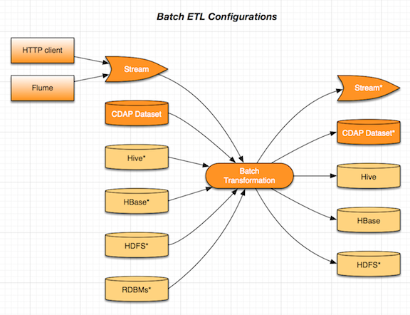
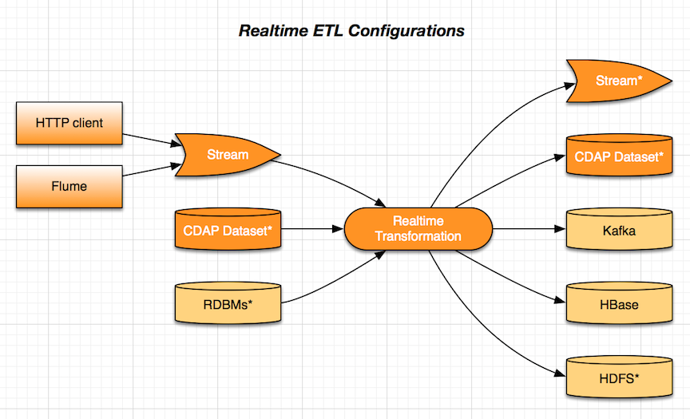

ETL-pack Library
================

ETL-pack library is designed to ease the development of common ETL solutions and provide powerful extension
capabilities. Developers can use it as is without any coding required to perform standard tasks like
incremental moving of data between Hive tables with applied transformation using input/ouput schema mapping and more.

At the same time developers can implement their own source and sink types as well as custom transformation logic. 
ETL-pack provides necessary abstractions and base building blocks for developer to focus on business logic and not 
infrastructure and operation boilerplate. Developed components are transferrable and re-usable in many different 
environment with CDAP.

Batch and Realtime ETL
----------------------

Currently ETL-pack supports two types of ETL pipelines: batch and real-time. Batch processing happens with help of 
MapReduce jobs. Real-time processing utilizes Tigon Flows container. There are number of configuration options 
for ETL pipeline as displayed below.

|(Batch)|

|(Realtime)|

The base class for batch ETL is BatchETL. Code below shows example application developed using BatchETL which 
pre-defined configuration:

.. code:: java

  public class StreamToHBaseETL extends BatchETL {
    @Override
    protected void configure(BatchETL.Configurer configurer) {
      configurer.addStream(new Stream("userDetails"));
      configurer.setSource(new StreamSource(getInSchema(), "userDetails"));
      configurer.setTransformation(
                 new DefaultSchemaMapping(getInSchema(), getOutSchema(), getMapping()));
      configurer.setSink(new HBaseSink("my.zk.quorum.host.net", "2181", "/hbase",
                                       "users-table", "colfam", "user_id"));
    }
 
    private Schema getInSchema() {
      return new Schema(ImmutableList.of(new Field("userId", FieldType.STRING),
                                         new Field("firstName", FieldType.STRING),
                                         new Field("lastName", FieldType.STRING)));
    }
  
    private Schema getOutSchema() {
      return new Schema(ImmutableList.of(new Field("user_id", FieldType.INT),
                                         new Field("name", FieldType.STRING)));
    }
  
    private ImmutableMap<String, String> getMapping() {
      return ImmutableMap.of(“user_id”, "userId",
                             "name", "first_name + ' ' + last_name");
    }
  }

Note that BatchETL application can be used as is, by providing all the configuration (e.g. the one hard-coded in 
code sample above) with runtime arguments in JSON format. The latter method is used by Subscription Management 
webapp to avoid rebuilding application jar for different subscription configurations.

The base class for real-time ETL is RealtimeETL. The following code shows example application developed using 
BatchETL which pre-defined configuration

.. code:: java

  public class StreamToKafkaETL extends RealtimeETL {
    @Override
    protected void configure(RealtimeETL.Configurer configurer) {
      configurer.addStream(new Stream("userDetails"));
      configurer.setSource(new SchemaSource(getInSchema(), "userDetails"));
      configurer.setTransformation(
        new DefaultSchemaMapping(getInSchema(), getOutSchema(), getMapping()));
      configurer.setSink(new KafkaSink("my.zk.quorum.host.net:2181", "my-kafka-topic"));
    }
  
    private Schema getInSchema() {...}
  
    private Schema getOutSchema() {...}
  
    private ImmutableMap<String, String> getMapping() {...}
  }
  
Note that similarly to BatchETL application the RealtimeETL app can be used as is, by providing the configuration 
with runtime argumets in JSON format.

Source
------

ETL-pack comes with number of sources available out of the box, like TableSource, StreamSource, MetadataSource which 
can be used in real-time and batch ETL. It also comes with higher-level abstractions and base classes to ease 
implementing custom source. The following code shows the interfaces to implement for real-time and batch cases.

.. code:: java

  public interface RealtimeSource extends ConfigurableProgram<FlowletContext> {
    Record read(StreamEvent streamEvent) throws Exception;
  }

.. code:: java

  public interface MapReduceSource<KEY_TYPE, VALUE_TYPE> extends ConfigurableProgram<MapReduceContext> {
    void prepareJob(MapReduceContext context);
    void onFinish(boolean succeeded, MapReduceContext context) throws Exception;
    Iterator<Record> read(KEY_TYPE key, VALUE_TYPE value);
  }

Example below shows implementation of standard MetadataSource to give an example of how easy it is 
to implement a custom source.

.. code:: java

  public class MetadataSource extends AbstractConfigurableProgram<FlowletContext> implements RealtimeSource {  
    @Override
    public Record read(StreamEvent streamEvent) throws Exception {
      Record.Builder builder = new Record.Builder();
      for (Map.Entry<String, String> header : streamEvent.getHeaders().entrySet()) {
        builder.add(header.getKey(), header.getValue().getBytes(Charsets.UTF_8));
      }
      return builder.build();
    }
  }

Available source types: Stream and Stream Metadata. The latter one allows to work with Stream events metadata.

Stream
~~~~~~

Stream source uses body of the stream even sent by Router. Its only configuration parameter 
is the name of the source stream::

  {
    "etl.source.mr.stream.id": "someStream"
  }

Similarly for real-time stream source::

  {
    "etl.source.realtime.stream.id": "someStream"
  }

In addition to this stream source uses input schema. Schema is a list of fields defined by name and type::

  [
    {
      "name": "userId",
      "type": "INT"
    },
    {
      "name": "lastName",
      "type": "STRING"
    },
    {
      "name": "firstName",
      "type": "LONG"
    }
  ]

Available field types are: STRING, INT, LONG, FLOAT, DOUBLE.

Stream Metadata
~~~~~~~~~~~~~~~

Stream Metadata source uses stream event headers and stream event metadata like size of the event’s body. 
Configuration of the Stream Metadata source is the same as of Stream source. The difference is that it 
doesn’t use input schema: event’s header name and value are used as Record’s field name and value.

Transformation
--------------

ETL-pack comes with number of transformation options available out of the box, like IdentityTransformation, 
ScriptableSchemaMapping, etc. It also comes with higher-level abstractions and base classes to ease implementing 
custom source. Code below shows the interface to implement for transformation.

.. code:: java

  public interface Transformation extends ConfigurableProgram<RuntimeContext> {
    @Nullable
    Record transform(Record input) throws IOException, InterruptedException;
  }

Example below shows implementation of standard MetadataSource to give an example of how easy it is to 
implement a custom source.

.. code:: java

  public class FilterByFields extends AbstractConfigurableProgram<RuntimeContext> implements Transformation {
    public static final String ARG_INCLUDE_BY = "etl.transform.filterByFields.includeBy";
  
    private Map<String, String> includeBy;
  
    @Override
    public void initialize(RuntimeContext context) {
      String includeByArg = Programs.getRequiredArgOrProperty(context, ARG_INCLUDE_BY);
      this.includeBy = new Gson().fromJson(includeByArg, Map.class);
    }
  
    @Nullable
    @Override
    public Record transform(Record input) {
      for (Map.Entry<String, String> mustHave : includeBy.entrySet()) {
        if (!mustHave.getValue().equals(input.getValue(mustHave.getKey()))) {
          return null;
        }
      }
      return input;
    }
  }
  
Example above demonstrates integration of the ETL component with ETL program lifecycle. 
The FilterByFields uses required fields with values passed by user on ETL program start.

There are two types of transformations available: Identitiy function and SchemaMapping.
The former one doesn’t do any transformation effectively and hence neither requires any configuration nor 
uses any of the input or output schemas. It is useful as a shortcut for delivering data as is.

SchemaMapping
~~~~~~~~~~~~~

Using schema mapping as transformation type allows user to convert Record from the source of 
the input schema into output record of the output schema for the destination. But not only simple 
fields mapping and type conversion is available: user can use javascript expressions in output 
values and lookup and join with dictionaries available::

  {
    "etl.transform.schema.mapping": {
      "user_id": "userId",
      "user_name": "lookup('users', userId, 'firstName') + ' ' + lookup('users', userId, 'lastName')",
      "message_length": "message.length"
    }
  }

In this example output user_id field is set with value of input userId field with type conversion applied if needed.
The user_name field is set with “<firstName> <lastName>” value. Where firstName and lastName are looked up in ‘users’
dictionary using userId field value of the input record. The message_length field is set with the length of the value
of the message field of the input record.

Sink
----

ETL-pack comes with number of sinks available out of the box, like HiveSink, KafkaSink, 
HBaseSink, DictionarySink which can be used in real-time and batch ETL. It also comes with 
higher-level abstractions and base classes to ease implementing custom sink. Code samples below 
show the interfaces to implement for real-time and batch cases.

.. code:: java

  public interface RealtimeSink extends ConfigurableProgram<FlowletContext> {
    void write(Record value) throws Exception;
  }
  
.. code:: java

  public interface MapReduceSink extends ConfigurableProgram<MapReduceContext> {
    void prepareJob(MapReduceContext context) throws IOException;
    void write(Mapper.Context context, Record value) throws IOException, InterruptedException;
  }
  
Similarly to Source and Transformation, Sink can be integrated CDAP acpplication components lifecycle to 
e.g. use run-time user arguments.

Hive
~~~~

HiveSink is used to output data into Hive table when using batch ETL pipeline. 
To configure the sink user provides information about destination Hive cluster as well as table details::

  {
    "etl.sink.mr.hive.metastoreURI": "thrift://hive.metastore.host:9083",
    "etl.sink.mr.hive.hiveServerURI": "jdbc:hive://hive.server.host:9083",
    "etl.sink.mr.hive.basedir": "/tmp",
    "etl.sink.mr.hive.db": "default",
    "etl.sink.mr.hive.table": "my_table",
    "etl.sink.mr.hive.partitionValues": {"type":"suppliers"}
  }

If table does not exist, it will be created using provided configuration. 

Optionally, user can define partition field values on per subscription basis (“type”=”suppliers” in this example).

HBase
~~~~~

HBaseSink can be used to output data into HBase table in both batch and real-time ETL. 
To configure the sink user provides HBase cluster information, HBase table information to write to and 
Record’s field which value to be used as row key::

  {
    "etl.sink.realtime.hbase.zookeeper.quorum": "zk.hostname",
    "etl.sink.realtime.hbase.zookeeper.client.port": "2181",
    "etl.sink.realtime.hbase.zookeeper.parent.node": "/hbase"
    "etl.sink.realtime.hbase.table.name": "my_table",
    "etl.sink.realtime.hbase.table.colfam": "some_table_family",
    "etl.sink.realtime.hbase.row.key.field": "some_row_key",
  }

If table does not exist it will be created using provided information.

Kafka
~~~~~

KafkaSink can be used to output data into Kafka topic in both batch and real-time ETL. 
To configure the sink user provides Kafka cluster information, Kafka topic to write to::

  {
    "etl.sink.mr.kafka.zookeeper.quorum": "zk.hostname:2181",
    "etl.sink.mr.kafka.topic": "my_topic",
    "etl.sink.mr.kafka.partition.field": "userType"
  }

Optionally user can specify Record’s field which value to be used for partitioning.

Dictionary
~~~~~~~~~~

DictionarySink can be used to fill dictionaries with data available for lookup during transformation part 
of subscription ETL. It can be used in both batch and real-time.

DictionarySink takes dictionary name and field name to be used as key for lookup as the configuration::
 
  {
    "etl.sink.realtime.dictionary.name": "users",
    "etl.sink.realtime.dictionary.keyField": "userId"
  }

Unit-testing
------------

CDAP provides extensive support for create productive development environment, 
which includes unit-tests framework for testing both application components and application as a whole. 
Code below shows example of unit-test of the application that was introdiced above.

.. code:: java

  public class MyApplicationTest extends TestBase {
    private static HBaseTestBase testHBase;
  
    @BeforeClass
    public static void beforeClass() throws Exception {
      testHBase = new HBaseTestFactory().get();
      testHBase.startHBase();
    }
  
    @AfterClass
    public static void afterClass() throws Exception {
      testHBase.stopHBase();
    }
  
    @Test
    private void testETL() throws Exception {
      // deploy etl app
      ApplicationManager applicationManager = deployApplication(MyApplication.class);
      StreamWriter streamWriter = applicationManager.getStreamWriter("userDetails");
      streamWriter.send("1,Jack,Brown");
  
      // run etl job
      Map<String, String> args = ImmutableMap.of(HBaseSink.ARG_ZK,
                                                 testHBase.getZkConnectionString());
      MapReduceManager mr = applicationManager.startMapReduce("BatchETLMapReduce", args);
      mr.waitForFinish(2, TimeUnit.MINUTES);
  
      // verify results
      HTable hTable = testHBase.getHTable("users-table");
      Result result = hTable.get(new Get(Bytes.toBytes(1)));
      Assert.assertFalse(result.isEmpty());
      Assert.assertEquals("Jack Brown",
                          result.getValue(Bytes.toBytes("colfam"), Bytes.toBytes("name")));
    }
  }

In this example unit-test uses HBaseTestBase utility provided by unit-testing framework to test output
into external HBase table using HBaseSink. When only internal Reactor components (like DataSets) are 
used by the application, unit-tests are simplified even further, as shown in code below.

.. code:: java

  public class MyApplicationTest extends ReactorTestBase {
    @Test
    private void testETL() throws Exception {
      // deploy etl app
      ApplicationManager applicationManager = deployApplication(MyApplication.class);
      StreamWriter streamWriter = applicationManager.getStreamWriter("userDetails");
      streamWriter.send("1,Jack,Brown");
  
      // run etl job
      MapReduceManager mr = applicationManager.startMapReduce("BatchETLMapReduce");
      mr.waitForFinish(2, TimeUnit.MINUTES);
  
      // verify results
      DictionaryDataSet dictionary = appMngr.getDataSet(Constants.DICTIONARY_DATASET).get();
      Assert.assertEquals("Jack Brown",
                          Bytes.toString(dictionary.get("users", Bytes.toBytes(1), "name")));
    }
  }

In this example we test same application but with sink changed to DictionarySink 
which can be used for lookup during data transformation. Note that unit-test framework provides 
in-memory runtime for datasets for fast execution.

License
=======

Copyright © 2014 Cask Data, Inc.

Licensed under the Apache License, Version 2.0 (the "License"); you may not use this file except in compliance with the License. You may obtain a copy of the License at

  http://www.apache.org/licenses/LICENSE-2.0

Unless required by applicable law or agreed to in writing, software distributed under the License is distributed on an "AS IS" BASIS, WITHOUT WARRANTIES OR CONDITIONS OF ANY KIND, either express or implied. See the License for the specific language governing permissions and limitations under the License.

